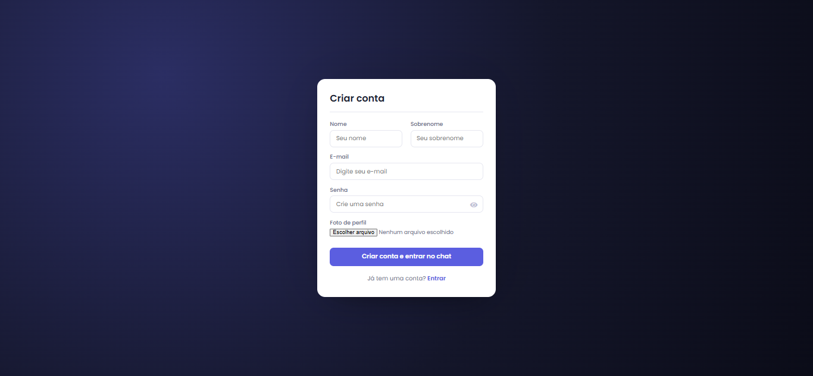
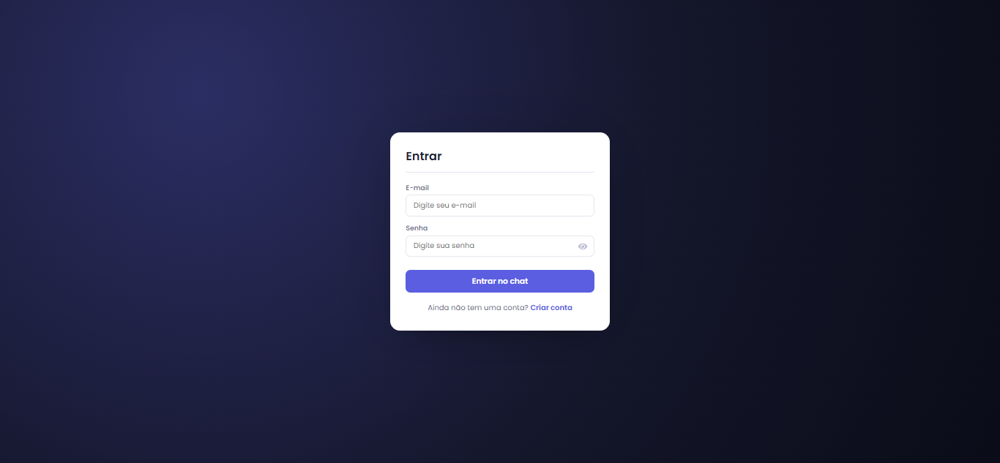
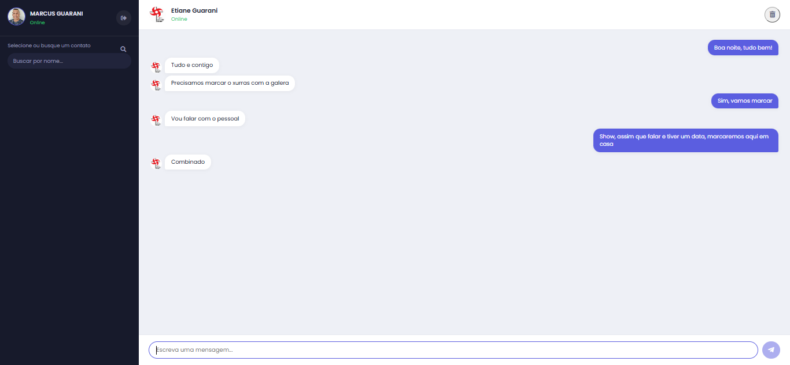
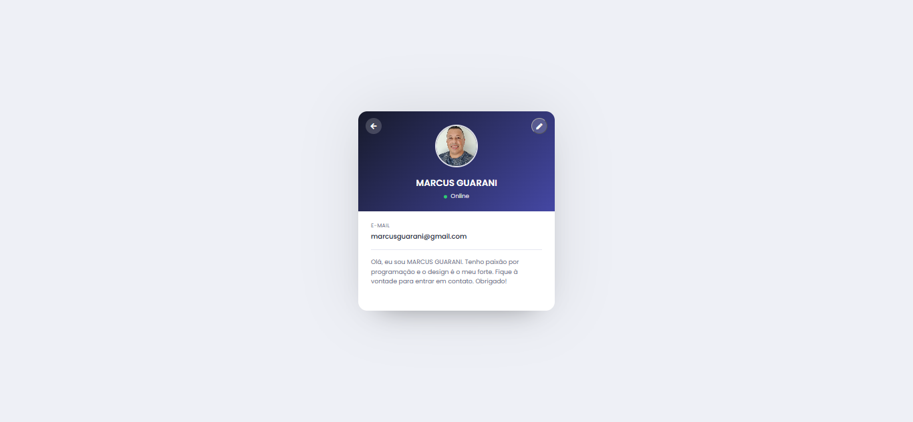
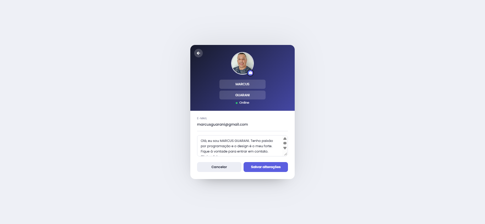
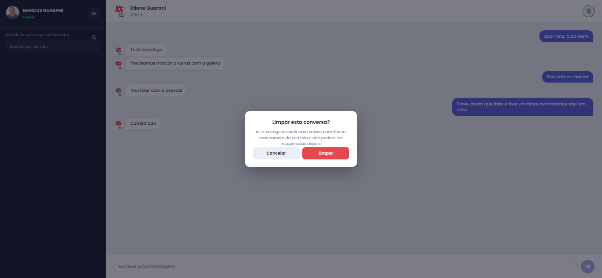

<div align="center">

# 💬 ConectaChat

</div>

ConectaChat é uma aplicação de chat web, com layout dividido em duas colunas (lista de contatos + conversa), no estilo dos principais apps de chat do mercado. 
Front-end em JavaScript puro (sem frameworks) e back-end em PHP + MySQL.


## ✨ Funcionalidades

- Cadastro e autenticação de usuários
- Busca de contatos
- Chat em tempo (quase) real, via polling AJAX
- Armazenamento persistente das mensagens em MySQL
- Layout responsivo — barra lateral fixa no desktop, tela única no mobile
- Edição de perfil: nome, foto e biografia
- Limpar conversa (some só da sua tela — o histórico continua salvo para o outro contato)

## 🖼️ Screenshots








## 🚀 Instalação

Para rodar localmente:

1. Clone este repositório:
   ```bash
   git clone https://github.com/marcusguarani/conecta-chat.git
   cd conecta-chat
   ```

2. Crie o banco de dados MySQL usando o dump em `backup/webchatapp.sql` e ajuste as credenciais em `php/config.php`.

3. Sirva os arquivos PHP com um servidor local (XAMPP, Laragon, ou `php -S localhost:8000`).

4. Acesse `index.php` no navegador para criar sua conta.

## 🛠️ Tecnologias utilizadas

- JavaScript (vanilla)
- HTML5 / CSS3
- PHP
- MySQL
- AJAX (XMLHttpRequest)
- Font Awesome

## 🤝 Contribuindo

Contribuições são bem-vindas! Sinta-se à vontade para abrir issues ou enviar pull requests com correções e sugestões.

## 📄 Licença

Este projeto está licenciado sob a licença MIT — veja o arquivo [LICENSE](LICENSE) para mais detalhes.

## 👤 Autor

**Marcus Guarani**

[](https://github.com/marcusguarani)
[](https://www.linkedin.com/in/marcusguarani)
[](https://marcusguarani.com.br)

